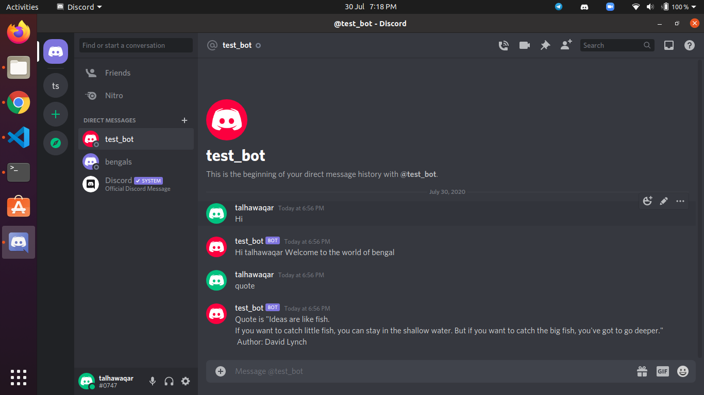

# Discord-Bot

## Content

<a text-align="center" href="#about">About</a>&nbsp;&nbsp;&nbsp;|&nbsp;&nbsp;&nbsp;
<a href="#with">Built with</a>&nbsp;&nbsp;&nbsp;|&nbsp;&nbsp;&nbsp;
<a href="#setup">Screenshot</a>&nbsp;&nbsp;&nbsp;|&nbsp;&nbsp;&nbsp;
<a href="#setup">Set-up</a>&nbsp;&nbsp;&nbsp;|&nbsp;&nbsp;&nbsp;
<a href="#author">Author</a>

## About 

I am introducing this discord bot it will give reply when you say hi. This bot can send you inspirational quotes and funny jokes to you when you press certain commands.

## 🔧 Built with

- Ruby

## Screenshot with

## 🔨 Setup 

- To clone the repo to your local repository. Follow this steps
- <code> git clone https://github.com/talhawaqar/discord_bot.git</code>
- <code> cd discord_bot</code>
- Set up bot app in your discord account [@click here](https://github.com/talhawaqar) to get video tutorail
- <code>bin/main.rb</code>

### Run Tests

- Open Terminal
- Change directory to folder to download repository
- Use `cd <file-path>`
- Run `gem install rspec`
- Run `rspec`

## Authors

👤 **Muhammad Talha Waqar**

- Github: [@talhawaqar](https://github.com/talhawaqar)
- Linkedin: [@talha-waqar](https://www.linkedin.com/in/talha-waqar-977257145/)
- Twitter: [@MuhammadTalhaW4](https://twitter.com/MuhammadTalhaW4)
- email: (talhawaqar007@hotmail.com)
- email: (talhawaqar007@gmail.com)

## 🤝 Contributing

Contributions, issues and feature requests are welcome!

Feel free to check the fork this repo and create pull request if you want to make changes.

## 👍 Show your support

Give a ⭐️ if you like this project!

## :thumbsup: Acknowledgements

[Muhammad Talha Waqar](https://github.com/talhawaqar) 

https://www.loom.com/share/564affdc8acf476fbb5410402ae28add
